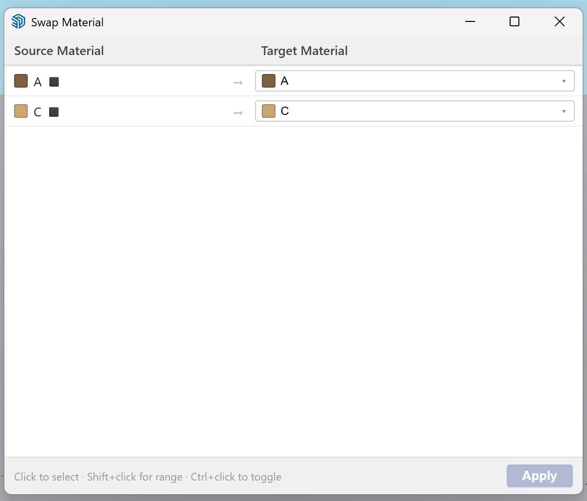
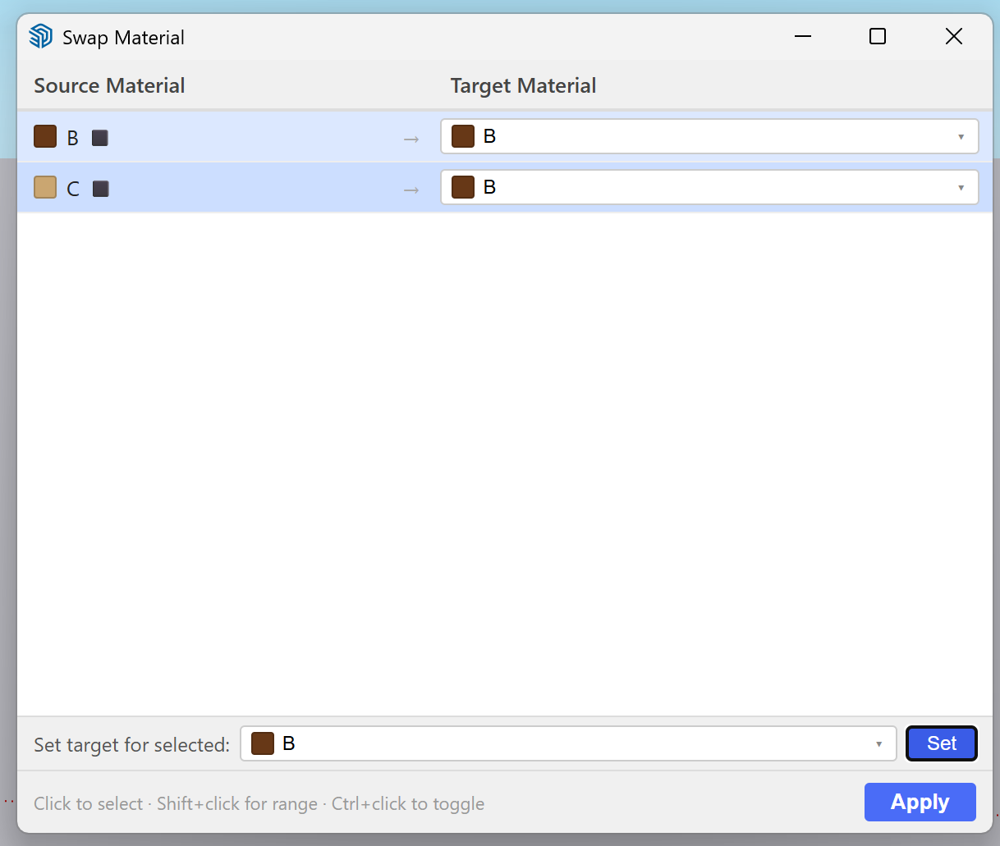

# Swap Material

A SketchUp extension that replaces one or more materials with another inside selected geometry — faces, groups, and components — via a mapping-table dialog.

## Features

- Select any combination of faces, groups, or components and swap their materials in one step
- Map multiple source materials to different targets at once
- Bulk-assign a target to several rows at once using the selection bar
- Searchable target dropdown — type to filter the material list
- Preserves UV mapping when swapping between two textured materials
- Single undoable operation (Ctrl+Z)

## Screenshots

Mapping each source material to a different target:

Bulk-assigning the same target to multiple selected rows:

## Installation

**Via Extension Warehouse (recommended):**
Install with one click from the [Swap Material page on SketchUp Extension Warehouse](https://extensions.sketchup.com/extension/e5f2abae-ad93-45de-9ac1-1f3710898bed/swap-material).

**Manual install:**
1. Download the latest `.rbz` from [Releases](../../releases)
2. In SketchUp: **Window → Extension Manager → Install Extension**
3. Select the downloaded `.rbz` file

## Usage

1. Select one or more faces, groups, or components in your model
2. Go to **Extensions → Swap Material**
3. In the dialog, set the target material for each row you want to change
4. Click **Apply**

## Requirements

SketchUp 2017 or later

## License

[MIT](LICENSE)
